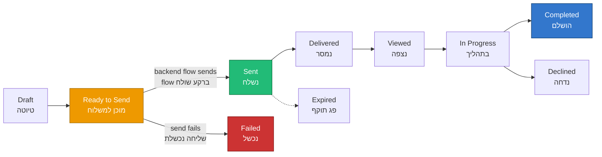

# Customer Insights – Journeys ↔ easydo Signature Integration

Integrating easydo e‑signature requests with Dynamics 365 **Customer Insights – Journeys (CIJ)**.
שילוב בקשות חתימה אלקטרונית של easydo עם **Customer Insights – Journeys (CIJ)** ב‑Dynamics 365.

> **Bottom line / שורה תחתונה:** A CIJ trigger should react to the **Sent** status (`626210002`), not **Ready to Send** — because *Ready to Send* is a transient internal state that may still fail, while *Sent* is the confirmed event that the request actually reached the customer.
> טריגר ב‑CIJ צריך להגיב לסטטוס **נשלח** (`626210002`), לא ל**מוכן למשלוח** — כי *מוכן למשלוח* הוא מצב ביניים פנימי שעוד עלול להיכשל, ואילו *נשלח* הוא האירוע המאומת שהבקשה באמת הגיעה ללקוח.

---

## 1. How the pieces fit together / איך החלקים מתחברים

**English.** A signature request is a Dataverse record (`alex_signaturerequest`). Its `alex_status` column moves through a lifecycle. A backend Power Automate flow ([send-signature-request](../src/flows/send-signature-request.flow.json)) listens for the **Ready to Send** status, calls easydo, and on success sets the status to **Sent**. A second scheduled flow ([read-signature-results](../src/flows/read-signature-results.flow.json)) polls easydo and advances the status to **Delivered / Viewed / Completed**. CIJ plugs in by **reacting** to these status changes to drive journeys (confirmations, reminders, follow‑ups).

**עברית.** בקשת חתימה היא רשומת Dataverse (`alex_signaturerequest`). העמודה `alex_status` עוברת מחזור חיים. flow ברקע ([send-signature-request](../src/flows/send-signature-request.flow.json)) מאזין לסטטוס **מוכן למשלוח**, קורא ל‑easydo, ובהצלחה מעדכן ל**נשלח**. flow מתוזמן שני ([read-signature-results](../src/flows/read-signature-results.flow.json)) מושך עדכונים מ‑easydo ומקדם את הסטטוס ל**נמסר / נצפה / הושלם**. CIJ משתלב על‑ידי **תגובה** לשינויי הסטטוס הללו כדי להניע מסעות (אישורים, תזכורות, המשך טיפול).

---

## 2. Status reference / טבלת סטטוסים

Choice: `alex_signaturestatus` on `alex_signaturerequest.alex_status`.
בחירה: `alex_signaturestatus` על `alex_signaturerequest.alex_status`.

| Value / ערך | English | עברית | Meaning / משמעות |
|---|---|---|---|
| `626210000` | Draft | טיוטה | Created in Dynamics, not yet sent. נוצר ב‑Dynamics, טרם נשלח. |
| `626210001` | Ready to Send | מוכן למשלוח | Validated; queued for the backend flow. **Transient.** אומת; בתור ל‑flow. **טרנזיינטי.** |
| `626210002` | **Sent** | **נשלח** | easydo accepted it; request reached the customer. **Confirmed.** easydo קיבל; הבקשה הגיעה ללקוח. **מאומת.** |
| `626210003` | Delivered | נמסר | easydo confirmed delivery. easydo אישר מסירה. |
| `626210004` | Viewed | נצפה | Recipient opened the document. הנמען פתח את המסמך. |
| `626210005` | In Progress | בתהליך | One or more recipients are signing. נמען אחד או יותר בתהליך חתימה. |
| `626210006` | Completed | הושלם | All required recipients signed. כל הנמענים הנדרשים חתמו. |
| `626210007` | Declined | נדחה | A recipient refused to sign. נמען סירב לחתום. |
| `626210008` | Failed | נכשל | Delivery/processing error. שגיאת משלוח/עיבוד. |
| `626210009` | Cancelled | בוטל | Cancelled before completion. בוטל לפני השלמה. |
| `626210010` | Expired | פג תוקף | Expired before all signed. פג תוקף לפני שכולם חתמו. |
| `626210011` | Pending Retry | ממתין לניסיון חוזר | Transient error; queued to retry. שגיאה זמנית; ממתין לניסיון חוזר. |

---

## 3. Which status should the CIJ trigger listen to? / לאיזה סטטוס הטריגר ב‑CIJ צריך להאזין?

**English.** It depends on the journey's purpose — but the rule is: **listen to a confirmed, meaningful business event, not a transient processing state.**

- **Do NOT trigger on `Ready to Send` (626210001).** It is only an instruction to the backend flow. Nothing has happened yet; the send can still flip to **Failed**. A journey started here may run for requests that never reached the customer, and the record has no `formId`/signing link yet (race condition).
- **Trigger on `Sent` (626210002)** to react to *"the request actually went out."* At this point the `formId` and signing link exist and the send succeeded.

**עברית.** תלוי במטרת המסע — אבל הכלל: **להאזין לאירוע עסקי מאומת ומשמעותי, לא למצב עיבוד טרנזיינטי.**

- **אין להפעיל טריגר על `מוכן למשלוח` (626210001).** זו רק הוראה ל‑flow ברקע. עדיין לא קרה כלום; השליחה עוד יכולה לעבור ל**נכשל**. מסע שמתחיל כאן עלול לרוץ עבור בקשות שמעולם לא הגיעו ללקוח, ולרשומה עדיין אין `formId`/קישור חתימה (מרוץ).
- **הפעל טריגר על `נשלח` (626210002)** כדי להגיב ל*"הבקשה באמת יצאה."* בנקודה זו ה‑`formId` וקישור החתימה קיימים והשליחה הצליחה.

---

## 4. Trigger patterns / תבניות טריגר

| Goal / מטרה | Listen to status / להאזין לסטטוס | Value |
|---|---|---|
| Confirm the request was sent / אישור שהבקשה נשלחה | Sent / נשלח | `626210002` |
| Nudge after delivery / דחיפה לאחר מסירה | Delivered / נמסר | `626210003` |
| Reminder if opened but not signed / תזכורת אם נצפה ולא נחתם | Viewed / נצפה | `626210004` |
| Celebrate / close on signing / סיום בחתימה | Completed / הושלם | `626210006` |
| Recover a refusal / טיפול בסירוב | Declined / נדחה | `626210007` |
| Handle a send failure / טיפול בכשל שליחה | Failed / נכשל | `626210008` |

**Implementation note / הערת מימוש.** In CIJ, create a **Dataverse-based trigger** on the `alex_signaturerequest` table, then add a condition on `alex_status` equal to the target value above. For reminders, combine the **Viewed** trigger with a wait branch and re‑check that the status has not advanced to **Completed**.
ב‑CIJ צרו **טריגר מבוסס Dataverse** על הטבלה `alex_signaturerequest`, והוסיפו תנאי ש‑`alex_status` שווה לערך המבוקש לעיל. לתזכורות — שלבו את טריגר **נצפה** עם ענף המתנה ובדיקה חוזרת שהסטטוס לא התקדם ל**הושלם**.

---

## 5. Caveats / הסתייגויות

- **English.** `Ready to Send` and `Pending Retry` are internal/transient — never use them as journey entry points. Always gate journeys on confirmed states (`Sent` and onward).
- **עברית.** `מוכן למשלוח` ו`ממתין לניסיון חוזר` הם פנימיים/טרנזיינטיים — לעולם אל תשתמשו בהם כנקודת כניסה למסע. תמיד התנו מסעות במצבים מאומתים (`נשלח` והלאה).
- **English.** A request can jump straight to `Failed` from `Ready to Send`; always design a parallel **Failed** branch so journeys do not hang.
- **עברית.** בקשה יכולה לקפוץ ישירות ל`נכשל` מ`מוכן למשלוח`; תכננו תמיד ענף **נכשל** מקביל כדי שמסעות לא ייתקעו.

---

See also / ראו גם: [docs/flow-schemas.md](flow-schemas.md) · [docs/technical-architecture.md](technical-architecture.md) · [docs/data-model.md](data-model.md)
