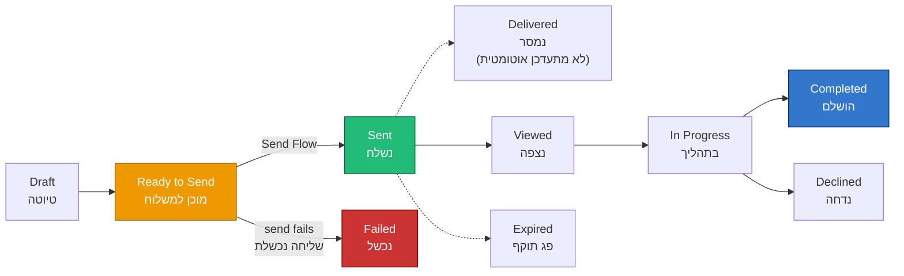

# שילוב easydo עם Customer Insights - Journeys

מסמך זה מסביר כיצד להפעיל מסעות ב־Dynamics 365 **Customer Insights - Journeys
(CIJ)** בעקבות שינויים בסטטוס של בקשות חתימה ב־easydo.

> **המלצה מרכזית:** כדי להתחיל מסע לאחר שליחה מוצלחת, יש להאזין לסטטוס
> **נשלח (`Sent`, ‏`626210002`)** ולא לסטטוס **מוכן למשלוח (`Ready to Send`,
> ‏`626210001`)**. הסטטוס „מוכן למשלוח” הוא מצב עיבוד זמני והשליחה עדיין עלולה
> להיכשל. האות הראשון שמאשר פעולה של הנמען הוא **נצפה (`Viewed`,
> ‏`626210004`)**. הסטטוס `Delivered` אינו נקבע אוטומטית, משום ש־easydo אינו
> מספק אישור מסירה אמין.

## תוכן עניינים

- [מבנה התהליך](#1-מבנה-התהליך)
- [טבלת הסטטוסים](#2-טבלת-הסטטוסים)
- [בחירת סטטוס לטריגר](#3-בחירת-סטטוס-לטריגר)
- [דפוסי טריגר מומלצים](#4-דפוסי-טריגר-מומלצים)
- [הסתייגויות](#5-הסתייגויות)

---

## 1. מבנה התהליך

בקשת חתימה נשמרת ב־Dataverse כרשומה בטבלה `alex_signaturerequest`. העמודה
`alex_status` מייצגת את מצב הבקשה לאורך התהליך.

Flow השליחה
([send-signature-request](../src/flows/send-signature-request.flow.json)) מופעל כאשר
הבקשה עוברת לסטטוס **מוכן למשלוח**. הוא שולח את הבקשה ל־easydo, ולאחר הצלחה
מעדכן אותה לסטטוס **נשלח**. בשלב זה קיימים המזהה החיצוני וקישור החתימה, אך אין
עדיין ודאות שההודעה נמסרה לנמען.

Flow מתוזמן
([read-signature-results](../src/flows/read-signature-results.flow.json)) בודק את מצב
הבקשות הפתוחות ב־easydo ומעדכן את הסטטוס ב־Dataverse. CIJ יכול להגיב לשינויים
אלה ולהפעיל מסעות אישור, תזכורת, טיפול בסירוב או סיום תהליך.

```mermaid
flowchart LR
    D["Draft<br/>טיוטה"] --> R["Ready to Send<br/>מוכן למשלוח"]
    R -->|"Send Flow"| S["Sent<br/>נשלח"]
    R -->|"send fails<br/>שליחה נכשלת"| F["Failed<br/>נכשל"]
    S -.-> DL["Delivered<br/>נמסר<br/>(לא מתעדכן אוטומטית)"]
    S --> V["Viewed<br/>נצפה"]
    V --> P["In Progress<br/>בתהליך"]
    P --> C["Completed<br/>הושלם"]
    P --> X["Declined<br/>נדחה"]
    S -.-> E["Expired<br/>פג תוקף"]
    linkStyle default stroke-width:1px
    style R fill:#e90,stroke:#960,color:#fff
    style S fill:#2b7,stroke:#063,color:#fff
    style C fill:#37c,stroke:#036,color:#fff
    style F fill:#c33,stroke:#700,color:#fff
```

---

התרשים מציג את המסלול המקובל. בפועל בקשה עשויה לדלג על חלק ממצבי הביניים,
בהתאם למידע שמוחזר מ־easydo.

## 2. טבלת הסטטוסים

העמודה `alex_signaturerequest.alex_status` משתמשת ב־Choice
`alex_signaturestatus`.

| ערך | שם רשמי | שם לתצוגה | משמעות |
|---|---|---|---|
| `626210000` | `Draft` | טיוטה | הבקשה נוצרה ב־Dynamics 365 וטרם נשלחה. |
| `626210001` | `Ready to Send` | מוכן למשלוח | הבקשה ממתינה לעיבוד על ידי Flow השליחה. זהו מצב זמני. |
| `626210002` | `Sent` | נשלח | easydo קיבל את הבקשה והשליחה הצליחה. המזהה החיצוני וקישור החתימה זמינים. |
| `626210003` | `Delivered` | נמסר | ערך שמור לאישור מסירה. אינו נקבע אוטומטית, משום שאין אות מסירה אמין מ־easydo. |
| `626210004` | `Viewed` | נצפה | הנמען פתח את המסמך. |
| `626210005` | `In Progress` | בתהליך | נמען אחד או יותר נמצאים בתהליך החתימה. |
| `626210006` | `Completed` | הושלם | כל הנמענים הנדרשים חתמו. |
| `626210007` | `Declined` | נדחה | נמען סירב לחתום. |
| `626210008` | `Failed` | נכשל | אירעה שגיאה בשליחה או בעיבוד. |
| `626210009` | `Cancelled` | בוטל | הבקשה בוטלה לפני השלמת החתימה. |
| `626210010` | `Expired` | פג תוקף | תוקף הבקשה פג לפני השלמת כל החתימות. |
| `626210011` | `Pending Retry` | ממתין לניסיון חוזר | אירעה שגיאה זמנית והבקשה ממתינה לניסיון נוסף. |

---

## 3. בחירת סטטוס לטריגר

יש לבחור סטטוס שמייצג אירוע עסקי מאומת בהתאם למטרת המסע, ולא מצב עיבוד זמני.

- **אין להפעיל מסע על `Ready to Send` (`626210001`).** זהו אות ל־Flow להתחיל
    את השליחה. הבקשה עדיין עלולה לעבור ל־`Failed`, וייתכן שהמזהה החיצוני וקישור
    החתימה טרם נוצרו.
- **יש להשתמש ב־`Sent` (`626210002`)** כאשר המסע צריך להתחיל לאחר שהשליחה
    ל־easydo הצליחה וקישור החתימה זמין.
- **אין לבסס מסע על `Delivered` (`626210003`) במימוש הנוכחי.** easydo אינו מספק
    אות מסירה אמין, ולכן הסטטוס אינו נקבע אוטומטית.
- **יש להשתמש ב־`Viewed` (`626210004`)** כאשר נדרש אישור ראשון לכך שהנמען פתח
    את המסמך.
- **יש להשתמש ב־`Completed` (`626210006`)** כאשר המסע צריך להתחיל רק לאחר
    השלמת כל החתימות הנדרשות.

---

## 4. דפוסי טריגר מומלצים

| מטרת המסע | סטטוס | ערך |
|---|---|---|
| אישור שהשליחה ל־easydo הצליחה | `Sent` / נשלח | `626210002` |
| פעולה לאחר פתיחת המסמך | `Viewed` / נצפה | `626210004` |
| תזכורת לאחר צפייה ללא חתימה | `Viewed` / נצפה, המתנה ובדיקה חוזרת | `626210004` |
| סיום המסע לאחר חתימה | `Completed` / הושלם | `626210006` |
| טיפול בסירוב לחתום | `Declined` / נדחה | `626210007` |
| טיפול בכשל שליחה | `Failed` / נכשל | `626210008` |

ב־CIJ יש ליצור טריגר מבוסס Dataverse על הטבלה `alex_signaturerequest` ולהוסיף
תנאי שלפיו `alex_status` שווה לערך המתאים. בתרחיש תזכורת מומלץ להתחיל בסטטוס
`Viewed`, להוסיף המתנה ולבדוק שוב שהבקשה טרם עברה ל־`Completed` לפני שליחת
התזכורת.

---

## 5. הסתייגויות

- `Ready to Send` ו־`Pending Retry` הם מצבי עיבוד פנימיים וזמניים. אין להשתמש
    בהם כנקודת כניסה למסע.
- בקשה יכולה לעבור ישירות מ־`Ready to Send` ל־`Failed`. יש לתכנן מסלול טיפול
    בכשל ולא להניח שכל בקשה תגיע ל־`Sent`.
- עדכון סטטוס עלול להתרחש יותר מפעם אחת. יש להגדיר את כללי הכניסה והיציאה כך
    שלא יישלחו הודעות כפולות.
- מסע שמתחיל ב־`Viewed` צריך לבדוק מחדש את הסטטוס לאחר ההמתנה, משום שהבקשה
    עשויה לעבור בינתיים ל־`Completed`, ‏`Declined`, ‏`Cancelled` או `Expired`.

---

## מסמכים קשורים

- [סכמות ה־Flows](flow-schemas.md)
- [ארכיטקטורה טכנית](technical-architecture.md)
- [מודל הנתונים](data-model.md)
