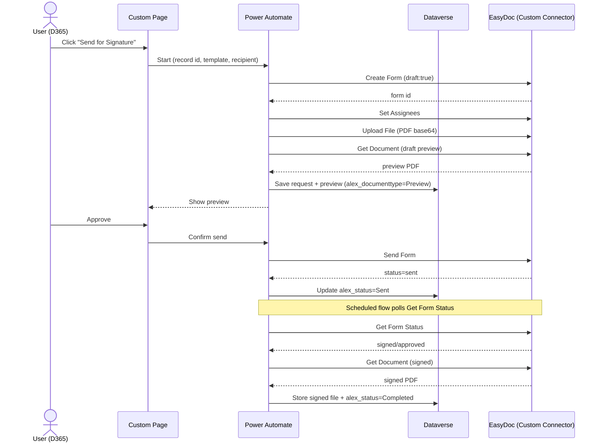

# Custom Connector — EasyDoc

> **תקציר בעברית:** מסמך זה מתאר את ה-Custom Connector היחיד שמחבר את Dynamics 365
> ל-EasyDoc. הקונקטור מכיל **actions בלבד** (ללא triggers ב-MVP). לכל פעולה מתואר:
> מה היא עושה, מי מפעיל אותה (משתמש או flow), מה המשתמש מזין/רואה, ומה הפעולה מחזירה.
> בשלב הבא (fast-follow) ניתן יהיה להוסיף **trigger יחיד** מסוג Webhook במקום ה-polling.
> כל הרכיבים נכנסים ל-solution הלא-מנוהל `alex_d365_easydo`.

## Overview

| Item | Value |
| --- | --- |
| Connector | **one** Custom Connector for EasyDoc |
| Auth | API Key / Bearer token, stored in a secure **Connection** |
| Base URL | EasyDoc API base, held in an **Environment Variable** (not committed) |
| Transport | Outbound HTTPS (TLS) only — no inbound endpoint in MVP |
| Triggers (MVP) | **None** — status is read by a scheduled flow calling *Get Form Status* |
| Triggers (later) | Optional single **Webhook** trigger ("Form Submitted") to replace polling |

The connector is a declarative OpenAPI definition only — it has no compute of its
own and exposes no inbound endpoint. All secrets live in the Connection / secure
Environment Variables, never in source control.

## Security model (summary)

- **Outbound only**: Power Automate calls EasyDoc; nothing calls back into us in MVP.
- **TLS** on every request; **Bearer token** required; token lives in the Connection.
- **DLP**: the connector is classified so it cannot be mixed with disallowed connectors.
- The dev token shared during early testing **must be regenerated before production**.

---

## Actions

Notation: **Caller** = who invokes it (End user via Custom Page, or a background Flow).
"User sees / enters" describes the meaningful inputs surfaced in the UX; technical
ids are passed by the flow, not typed by the user.

### 1. Get Profiles
- **Purpose**: List EasyDoc profiles/contacts for the entity (to resolve a recipient).
- **Caller**: Flow (and indirectly the Custom Page when picking a recipient).
- **User sees / enters**: optionally a search term (name / email).
- **Returns**: list of profiles — `id`, `full_name`, `email`, `phone`, `status`.
- **HTTP**: `GET /entity/me/profiles` *(verified live)*.

### 2. Get Templates
- **Purpose**: Retrieve EasyDoc templates and their fields, to sync into Dataverse
  (`alex_signaturetemplate` + `alex_templatefieldmapping`).
- **Caller**: Flow (admin-run sync, or scheduled).
- **User sees / enters**: nothing (admin sync), or a template picker in config.
- **Returns**: list of templates — template `id`, `name`, version, fields
  (`field id`, `name`, `type`, required), recipient slots.
- **HTTP**: `GET` templates endpoint *(exact path to verify against the API)*.

### 3. Create Form
- **Purpose**: Create a signature form from a template. With `draft:true` it is
  created as a **draft** so a preview can be produced before sending.
- **Caller**: Flow (triggered from the "Send for Signature" command).
- **User sees / enters**: chosen template, language (He/En), preview-mode toggle,
  and the mapped field values (prefilled from the Dynamics record, editable).
- **Returns**: `form id`, status, and a `meta_data` echo (we pass the D365
  record id + table name for correlation).
- **HTTP**: `POST /forms` *(from API research)*.

### 4. Set Assignees
- **Purpose**: Attach the recipient(s) who must sign.
- **Caller**: Flow.
- **User sees / enters**: the recipient — either an existing Contact, or an
  ad-hoc person (name + email/phone) and delivery method (email / SMS / link).
- **Returns**: assignee id(s) and their status (e.g. *waiting*).
- **HTTP**: `POST /forms/{id}/assignees` *(from API research)*.
- **Note**: only one assignee may be the primary `recipient:true`.

### 5. Upload File
- **Purpose**: Upload the document to be signed.
- **Caller**: Flow.
- **User sees / enters**: the source document (usually generated/selected
  automatically; the user does not paste base64).
- **Returns**: confirmation / document reference.
- **HTTP**: `POST /forms/{id}/upload` with the PDF as **base64** *(from API research)*.

### 6. Get Document (Preview / Signed)
- **Purpose**: Retrieve the PDF — the **draft preview** before sending, or the
  **final signed** PDF after completion.
- **Caller**: Flow (preview step, and completion step).
- **User sees / enters**: nothing — the returned PDF is shown in the Custom Page
  (preview) or stored on the record (signed).
- **Returns**: the PDF (base64 / file content) + content type.
- **Storage**: written to `alex_signaturedocument.alex_documentfile`
  (Dataverse File) with `alex_documenttype` = Preview or Signed.
- **HTTP**: `GET` document endpoint *(exact path to verify)*.

### 7. Send Form
- **Purpose**: Send the form to the recipient(s) for signature (exits draft).
- **Caller**: Flow (after the user approves the preview).
- **User sees / enters**: a final **confirm / send** click.
- **Returns**: updated status (e.g. *sent* / *in progress*).
- **HTTP**: `PUT /forms/{id}/send` *(from API research)*.

### 8. Get Form Status
- **Purpose**: Poll the current status of a form and its assignees.
- **Caller**: Scheduled **Flow** (this is the MVP replacement for a trigger).
- **User sees / enters**: nothing (background).
- **Returns**: form status + per-recipient status (waiting / in progress /
  viewed / signed / declined / approved), timestamps.
- **Mapping**: updates `alex_signaturerequest.alex_status` and
  `alex_signaturerecipient.alex_recipientstatus`.
- **HTTP**: `GET /forms/{id}` (or status endpoint) *(to confirm)*.

### 9. Cancel Form
- **Purpose**: Cancel an in-flight signature request.
- **Caller**: End user (command) → Flow.
- **User sees / enters**: a **cancel** action with optional reason.
- **Returns**: updated status (*cancelled*).
- **HTTP**: cancel endpoint *(to confirm)*.

---

## How the actions compose (send flow)

## Status mapping

| EasyDoc status | `alex_signaturestatus` |
| --- | --- |
| (draft created) | Draft |
| sent | Sent |
| waiting / in progress | In Progress |
| viewed | Viewed |
| declined | Declined |
| signed / approved | Completed |
| (error) | Failed → Pending Retry |
| (user cancel) | Cancelled |

## Open items to verify before build

- Exact paths/payloads for **Get Templates**, **Get Document**, **Get Form
  Status**, and **Cancel** (verified so far: `/entity/me`, `/entity/me/profiles`).
- Max upload size for **Upload File** (drives base64 handling / chunking).
- Whether template fields expose stable ids for the mapping table.

> Verifying these against the live API is the recommended next step so the
> connector's OpenAPI definition is correct on the first build.
