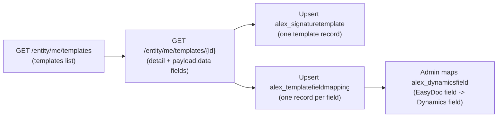
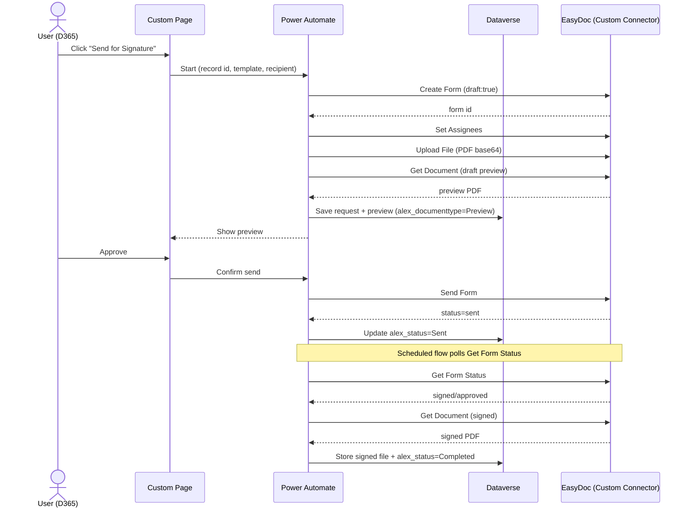

# Custom Connector — EasyDoc | קונקטור מותאם

> מסמך זה מתאר את ה-Custom Connector היחיד שמחבר את Dynamics 365
> ל-EasyDoc. הקונקטור מכיל **actions בלבד** (ללא triggers ב-MVP). לכל פעולה מתואר:
> מה היא עושה, מי מפעיל אותה (משתמש או flow), מה המשתמש מזין/רואה, ומה הפעולה מחזירה.
> בשלב הבא (fast-follow) ניתן יהיה להוסיף **trigger יחיד** מסוג Webhook במקום ה-polling.

## Overview

| Item | Value |
| --- | --- |
| Connector | **one** Custom Connector for EasyDoc |
| Auth | API Key / Bearer token, stored in a secure **Connection** |
| Base URL | EasyDoc API base, held in an **Environment Variable** (not committed) |
| Transport | Outbound HTTPS (TLS) only — no inbound endpoint in MVP |
| Triggers (MVP) | **None** — status is read by a scheduled flow calling *Get Form Status* |
| Triggers (later) | Optional single **Webhook** trigger ("Form Submitted") to replace polling |

The connector is a declarative OpenAPI definition only — it has no compute of its
own and exposes no inbound endpoint. All secrets live in the Connection / secure
Environment Variables, never in source control.

## Security model (summary)

- **Outbound only**: Power Automate calls EasyDoc; nothing calls back into us in MVP.
- **TLS** on every request; **Bearer token** required; token lives in the Connection.
- **DLP**: the connector is classified so it cannot be mixed with disallowed connectors.
- The dev token shared during early testing **must be regenerated before production**.

## Connection — what the user enters

> המשתמש/אדמין שמקים את החיבור מזין **רק את הטוקן של EasyDoc**.
> אין שם משתמש/סיסמה ואין סוד נוסף. הטוקן נשמר בתוך ה-Connection המאובטח של
> Power Platform ולא נחשף ב-flows או בקוד.

The connector authenticates with an **API key** sent as the `Authorization`
header. When creating a **Connection**, the only thing the user provides is the
**EasyDoc API token**:

| Field | Value to enter |
| --- | --- |
| EasyDoc token | `Bearer <your EasyDoc API token>` |

- The token is generated in the **EasyDoc portal** (Company settings → API).
- It is stored inside the Power Platform **Connection** (secure), not in flows,
  not in the connector definition, and not in source control.
- One Connection can be shared by all flows in the solution. For Test/Prod it is
  recommended that a **service principal / application user** owns the Connection.
- Rotating the token = update the Connection only; no flow changes needed.

## Definition files (in source control)

The connector is defined declaratively and added to the unmanaged solution:

| File | Purpose |
| --- | --- |
| [../src/custom-connector/apiDefinition.swagger.json](../src/custom-connector/apiDefinition.swagger.json) | OpenAPI 2.0 — all actions/paths |
| [../src/custom-connector/apiProperties.json](../src/custom-connector/apiProperties.json) | Auth (API key) + connection parameter UI |

These contain **no secrets** — the token is entered at connection time.

---

## Actions

Notation: **Caller** = who invokes it (End user via Custom Page, or a background Flow).
"User sees / enters" describes the meaningful inputs surfaced in the UX; technical
ids are passed by the flow, not typed by the user.

### 1. Get Profiles
- **Purpose**: List EasyDoc profiles/contacts for the entity (to resolve a recipient).
- **Caller**: Flow (and indirectly the Custom Page when picking a recipient).
- **User sees / enters**: optionally a search term (name / email).
- **Returns**: list of profiles — `id`, `full_name`, `email`, `phone`, `status`.
- **HTTP**: `GET /entity/me/profiles` *(verified live)*.

### 2. Get Templates
- **Purpose**: Retrieve EasyDoc templates and their fields, to sync into Dataverse
  (`alex_signaturetemplate` + `alex_templatefieldmapping`).
- **Caller**: Flow (admin-run sync, or scheduled).
- **User sees / enters**: nothing (admin sync), or a template picker in config.
- **Returns**: list of templates (DataTables envelope, read `data[]`) — template
  `id`, `name`, `type`, `status`, `dir_hash`, public `links[]`.
- **HTTP (list)**: `GET /entity/me/templates` *(verified live)*.
- **HTTP (detail + fields)**: `GET /entity/me/templates/{id}` *(verified live)*.
  Fields are in `payload.data[][]` and summarised in `data_headers[]`. Each field
  exposes a **stable `id` (GUID)**, a `name` (e.g. `custom_field_…`), an
  `export.header` (e.g. `customer_name`), a `type` (`input-text`,
  `input-signature`, `input-checkbox`, `input-date`, …), `required`, and `role_id`
  (recipient role). Use `id` or `name` as the stable key for
  `alex_templatefieldmapping.alex_externalfieldid` / `alex_externalfieldname`.

#### Template synchronization (import templates + their fields)

> ייבוא תבנית מושך גם את כל השדות שלה: תחילה רשימת התבניות, ואז
> פירוט כל תבנית עם השדות (שם, תווית, סוג, חובה, מזהה יציב). נוצרת רשומת תבנית אחת
> (`alex_signaturetemplate`) ורשומת מיפוי לכל שדה (`alex_templatefieldmapping`).
> צד EasyDoc מתמלא אוטומטית; את צד Dynamics (`alex_dynamicsfield`) משלים אדמין.

### 3. Create Form
- **Purpose**: Create a signature form from a template. With `draft:true` it is
  created as a **draft** so a preview can be produced before sending.
- **Caller**: Flow (triggered from the "Send for Signature" command).
- **User sees / enters**: chosen template, language (He/En), preview-mode toggle,
  and the mapped field values (prefilled from the Dynamics record, editable).
- **Returns**: `form id`, status, and a `meta_data` echo (we pass the D365
  record id + table name for correlation).
- **HTTP**: `POST /entity/me/forms` *(from API research)*.

### 4. Set Assignees
- **Purpose**: Attach the recipient(s) who must sign.
- **Caller**: Flow.
- **User sees / enters**: the recipient — either an existing Contact, or an
  ad-hoc person (name + email/phone) and delivery method (email / SMS / link).
- **Returns**: assignee id(s) and their status (e.g. *waiting*).
- **HTTP**: `POST /entity/me/forms/{id}/assignees` *(from API research)*.
- **Note**: only one assignee may be the primary `recipient:true`.

### 5. Upload File
- **Purpose**: Upload the document to be signed.
- **Caller**: Flow.
- **User sees / enters**: the source document (usually generated/selected
  automatically; the user does not paste base64).
- **Returns**: confirmation / document reference.
- **HTTP**: `POST /entity/me/forms/{id}/upload` with the PDF as **base64**, PDF
  only *(from API research)*.

### 6. Get Document (Preview / Signed)
- **Purpose**: Retrieve the PDF — the **draft preview** before sending, or the
  **final signed** PDF after completion.
- **Caller**: Flow (preview step, and completion step).
- **User sees / enters**: nothing — the returned PDF is shown in the Custom Page
  (preview) or stored on the record (signed).
- **Returns**: the PDF (base64 / file content) + content type.
- **Storage**: written to `alex_signaturedocument.alex_documentfile`
  (Dataverse File) with `alex_documenttype` = Preview or Signed.
- **HTTP**: `GET /entity/me/forms/{id}/download` *(route verified live;
  returns 400 for an unknown id)*. A complete PDF exists only when status is
  `signed`/`approved`; before that only the draft PDF is available.

### 7. Send Form
- **Purpose**: Send the form to the recipient(s) for signature (exits draft).
- **Caller**: Flow (after the user approves the preview).
- **User sees / enters**: a final **confirm / send** click.
- **Returns**: updated status (e.g. *sent* / *in progress*).
- **HTTP**: `PUT /entity/me/forms/{id}/send` *(from API research)*.

### 8. Get Form Status
- **Purpose**: Poll the current status of a form and its assignees.
- **Caller**: Scheduled **Flow** (this is the MVP replacement for a trigger).
- **User sees / enters**: nothing (background).
- **Returns**: form status + per-recipient status (waiting / in progress /
  viewed / signed / declined / approved), timestamps.
- **Mapping**: updates `alex_signaturerequest.alex_status` and
  `alex_signaturerecipient.alex_recipientstatus`.
- **HTTP**: `GET /entity/me/forms/{id}` *(route verified live; 400 for an
  unknown id)*. List all forms via `GET /entity/me/forms` (DataTables envelope).

### 9. Cancel Form
- **Purpose**: Cancel an in-flight signature request.
- **Caller**: End user (command) → Flow.
- **User sees / enters**: a **cancel** action with optional reason.
- **Returns**: updated status (*cancelled*).
- **HTTP**: `PUT /entity/me/forms/{id}/cancel` *(route verified live; only `PUT`
  is accepted — `POST` returns 405)*. To remove a draft entirely use
  `DELETE /entity/me/forms/{id}` *(route verified live)*.

---

## How the actions compose (send flow)

## Status mapping

| EasyDoc status | `alex_signaturestatus` |
| --- | --- |
| (draft created) | Draft |
| sent | Sent |
| waiting / in progress | In Progress |
| viewed | Viewed |
| declined | Declined |
| signed / approved | Completed |
| (error) | Failed → Pending Retry |
| (user cancel) | Cancelled |

## Verified endpoints (live, 2026-06-17)

All paths are under base `https://api.easydo.co.il/api`, `Authorization: Bearer <token>`.

| Action | Method & path | Status |
| --- | --- | --- |
| Get Profiles | `GET /entity/me/profiles` | ✅ verified |
| Get Templates (list) | `GET /entity/me/templates` | ✅ verified |
| Get Template (detail + fields) | `GET /entity/me/templates/{id}` | ✅ verified |
| Create Form | `POST /entity/me/forms` | research |
| Set Assignees | `POST /entity/me/forms/{id}/assignees` | research |
| Upload File | `POST /entity/me/forms/{id}/upload` | research |
| Send Form | `PUT /entity/me/forms/{id}/send` | research |
| List Forms | `GET /entity/me/forms` | ✅ verified |
| Get Form Status | `GET /entity/me/forms/{id}` | ✅ route verified |
| Download PDF | `GET /entity/me/forms/{id}/download` | ✅ route verified |
| Cancel Form | `PUT /entity/me/forms/{id}/cancel` | ✅ route verified (PUT only) |
| Delete Form (draft) | `DELETE /entity/me/forms/{id}` | ✅ route verified |

List endpoints return a **DataTables envelope**
(`{draw, recordsTotal, recordsFiltered, recordsReturned, recordsOffset, data:[]}`) —
read the `data[]` array. Errors return
`{message, error, hint, error_description}` (e.g. `record_not_accessible`).

## Remaining items to confirm during build

- **Max upload size** for *Upload File* (drives base64 handling / chunking) — to be
  measured with a real PDF.
- Exact request/response **bodies** for *Create Form → Assignees → Upload → Send*
  end-to-end (paths confirmed; payloads from API research, to be exercised once with
  a live send).
