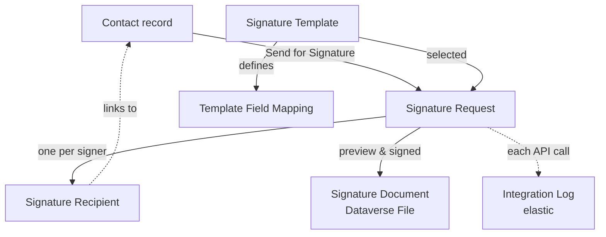

# Data Model

> **תקציר בעברית:** מסמך זה מתאר את מודל הנתונים שנבנה בפועל ב-Dataverse עבור פתרון
> חתימה דיגיטלית מול EasyDoc. הוא כולל 6 טבלאות (5 רגילות וטבלת יומן מסוג Elastic),
> רשימות בחירה גלובליות, קשרים, טפסים ותצוגות — הכל עם תוויות ותיאורים בעברית
> ובאנגלית. כל הרכיבים נבנו דרך ה-Dataverse Web API ונוספו ל-solution הלא-מנוהל.

The model was built entirely through the **Dataverse Web API** (no CLI table
creation, no manually imported XML) and added to the unmanaged solution
`alex_d365_easydo`. All tables, columns, choices, relationships, forms and views
carry **English (1033) and Hebrew (1037)** labels and descriptions.

All components use the publisher prefix **`alex_`** in the Dev environment.

## Build scripts

The model is reproducible via the scripts in [src/scripts/](../src/scripts/):

| Script | Purpose |
| --- | --- |
| `dv-common.ps1` | Web API connection + bilingual label helper |
| `dv-meta.ps1` | Table / column / choice / relationship builders |
| `02-create-solution.ps1` | Unmanaged solution `alex_d365_easydo` |
| `03-create-choices.ps1` | Global choices |
| `04-create-tables.ps1` | 6 tables (5 standard + 1 elastic) |
| `05-create-columns.ps1` | All business columns |
| `06-create-relationships.ps1` | Lookups / relationships |
| `07-create-file-column.ps1` | Dataverse File column for the document binary |
| `08-create-forms-views.ps1` | Main forms + system views, then publish |

## Global choices

| Name | Purpose | Options |
| --- | --- | --- |
| `alex_signaturestatus` | Signature request lifecycle | Draft, Ready to Send, Sent, Delivered, Viewed, In Progress, Completed, Declined, Failed, Cancelled, Expired, Pending Retry |
| `alex_recipientstatus` | Recipient signing progress | Waiting, In Progress, Viewed, Signed, Declined |
| `alex_recipienttype` | Recipient kind | Contact, External Person |
| `alex_documenttype` | Document role | Original, Preview, Signed, Evidence |
| `alex_deliverymethod` | Delivery channel | Email, SMS, Public Link |
| `alex_language` | Language | Hebrew, English |
| `alex_logdirection` | Integration direction | Outbound, Inbound |
| `alex_logresult` | Integration outcome | Success, Warning, Failure, Info |

## Tables

### `alex_signaturetemplate` — Signature Template (Standard)

Reusable EasyDoc template configuration.

| Column | Type | Notes |
| --- | --- | --- |
| `alex_name` | Text | Primary name — Template Name |
| `alex_externaltemplateid` | Text | EasyDoc template id (admin) |
| `alex_relateddynamicstable` | Text | Typical source table |
| `alex_language` | Choice (`alex_language`) | Default language |
| `alex_defaultdeliverymethod` | Choice (`alex_deliverymethod`) | Default channel |
| `alex_isactive` | Yes/No (Active/Inactive) | Available for use |
| `alex_supportspreview` | Yes/No | Preview before send |
| `alex_supportsmultiplesigners` | Yes/No | Multi-signer |
| `alex_templateversion` | Text | Version label |
| `alex_templatesummary` | Multiline | Business description |
| `alex_lastsyncedon` | DateTime | Last refresh from EasyDoc |

### `alex_signaturerequest` — Signature Request (Standard)

Central record for a single signature request.

| Column | Type | Notes |
| --- | --- | --- |
| `alex_name` | Text | Primary name — Request Name |
| `alex_templateid` | Lookup → Signature Template | |
| `alex_relatedcontactid` | Lookup → Contact | MVP source record |
| `alex_relatedrecordid` | Text | Source record id (generic) |
| `alex_relatedtablename` | Text | Source table logical name |
| `alex_status` | Choice (`alex_signaturestatus`), required | Lifecycle stage |
| `alex_language` | Choice (`alex_language`) | |
| `alex_isdraft` | Yes/No (Preview Mode) | Prepare as draft for preview |
| `alex_ispreviewgenerated` | Yes/No | Preview already generated |
| `alex_signinglink` | URL | Recipient signing link |
| `alex_senton` / `alex_completedon` / `alex_cancelledon` | DateTime | |
| `alex_externalformid` | Text | EasyDoc form id (support) |
| `alex_externaldocumentid` | Text | EasyDoc document id (support) |
| `alex_laststatuscheckon` | DateTime | Polling timestamp (support) |
| `alex_retrycount` | Number | Retry count (support) |
| `alex_errorcode` / `alex_errormessage` | Text / Multiline | Last error (support) |

### `alex_templatefieldmapping` — Template Field Mapping (Standard)

Maps Dynamics fields into EasyDoc template fields (configuration, not code).

| Column | Type | Notes |
| --- | --- | --- |
| `alex_name` | Text | Primary name — Mapping Name |
| `alex_templateid` | Lookup → Signature Template, required | |
| `alex_externalfieldid` / `alex_externalfieldname` / `alex_externalfieldtype` | Text | EasyDoc field (admin) |
| `alex_dynamicstable` / `alex_dynamicsfield` | Text | Source field |
| `alex_defaultvalue` | Text | Fallback value |
| `alex_isrequired` | Yes/No | Must have a value before send |
| `alex_iseditablebeforesend` | Yes/No | User-editable |
| `alex_isvisibletouser` | Yes/No | Shown to user |

### `alex_signaturerecipient` — Signature Recipient (Standard)

A person required to sign.

| Column | Type | Notes |
| --- | --- | --- |
| `alex_name` | Text | Primary name — Recipient Name |
| `alex_signaturerequestid` | Lookup → Signature Request, required | |
| `alex_recipienttype` | Choice (`alex_recipienttype`) | Contact / External |
| `alex_contactid` | Lookup → Contact | MVP primary link |
| `alex_externalrecipientname` | Text | For ad-hoc recipients |
| `alex_email` | Email | Delivery address |
| `alex_phone` | Phone | For SMS delivery |
| `alex_signingorder` | Number | Order for multi-signer |
| `alex_recipientstatus` | Choice (`alex_recipientstatus`) | Signing progress |
| `alex_preferredlanguage` | Choice (`alex_language`) | |
| `alex_externalprofileid` | Text | EasyDoc profile id (support) |
| `alex_recipientsigninglink` | URL | Personal signing link |
| `alex_recipientsenton` / `alex_viewedon` / `alex_signedon` | DateTime | |

### `alex_signaturedocument` — Signature Document (Standard)

Document files associated with a request.

| Column | Type | Notes |
| --- | --- | --- |
| `alex_name` | Text | Primary name — Document Name |
| `alex_signaturerequestid` | Lookup → Signature Request, required | |
| `alex_documenttype` | Choice (`alex_documenttype`) | Original / Preview / Signed / Evidence |
| `alex_filename` | Text | |
| `alex_mimetype` | Text | e.g. application/pdf |
| `alex_documentfile` | **File (Dataverse File storage)** | The actual binary, e.g. signed PDF |
| `alex_issigned` | Yes/No | Final signed copy |
| `alex_externalfileid` | Text | EasyDoc file id (support) |
| `alex_retrievedon` | DateTime | When retrieved from EasyDoc |

### `alex_integrationlog` — Integration Log (**Elastic**)

High-volume telemetry for each call / status update exchanged with EasyDoc.

> **Why elastic:** this is an append-only, high-volume support/diagnostics log.
> Elastic tables support standard columns, choices, forms, views, security and
> search, which is sufficient here. **Elastic tables do not support
> relationships**, so the link to a signature request is stored as the string
> reference `alex_signaturerequestref` (plus `alex_correlationid`) rather than a
> lookup. Charts are also unsupported and are disabled at creation.

| Column | Type | Notes |
| --- | --- | --- |
| `alex_name` | Text | Primary name — Log Title |
| `alex_signaturerequestref` | Text | Reference to the related request (support) |
| `alex_eventtype` / `alex_operationname` | Text | Event category / operation |
| `alex_direction` | Choice (`alex_logdirection`) | Outbound / Inbound |
| `alex_result` | Choice (`alex_logresult`) | Success / Warning / Failure / Info |
| `alex_correlationid` / `alex_externalreference` | Text | Correlation (support) |
| `alex_startedon` / `alex_completedon` | DateTime | |
| `alex_durationms` | Number | Operation duration (support) |
| `alex_errorcode` / `alex_errormessage` | Text / Multiline | (support) |
| `alex_summary` | Multiline | Safe, non-sensitive event summary |

## Relationships

```text
Signature Template 1 ──< Template Field Mapping   (alex_templateid, required)
Signature Template 1 ──< Signature Request        (alex_templateid)
Signature Request  1 ──< Signature Recipient      (alex_signaturerequestid, required)
Signature Request  1 ──< Signature Document       (alex_signaturerequestid, required)
Contact            1 ──< Signature Recipient      (alex_contactid)
Contact            1 ──< Signature Request        (alex_relatedcontactid)
Integration Log → Signature Request               (string reference; elastic, no lookup)
```

## Architecture diagram (ERD)

> **תקציר בעברית:** התרשים מציג את הטבלאות והקשרים ביניהן. הקווים המלאים הם קשרי
> Lookup אמיתיים ב-Dataverse; הקו המקווקו מ-Integration Log הוא הפניית מחרוזת
> (לא Lookup) מאחר שטבלת ה-Elastic אינה תומכת בקשרים.

```mermaid
erDiagram
    CONTACT ||--o{ ALEX_SIGNATUREREQUEST : "alex_relatedcontactid"
    CONTACT ||--o{ ALEX_SIGNATURERECIPIENT : "alex_contactid"
    ALEX_SIGNATURETEMPLATE ||--o{ ALEX_TEMPLATEFIELDMAPPING : "alex_templateid (required)"
    ALEX_SIGNATURETEMPLATE ||--o{ ALEX_SIGNATUREREQUEST : "alex_templateid"
    ALEX_SIGNATUREREQUEST ||--o{ ALEX_SIGNATURERECIPIENT : "alex_signaturerequestid (required)"
    ALEX_SIGNATUREREQUEST ||--o{ ALEX_SIGNATUREDOCUMENT : "alex_signaturerequestid (required)"
    ALEX_SIGNATUREREQUEST ..|| ALEX_INTEGRATIONLOG : "string ref (elastic, no lookup)"

    ALEX_SIGNATURETEMPLATE {
        text alex_name PK
        text alex_externaltemplateid
        choice alex_language
        bool alex_isactive
    }
    ALEX_SIGNATUREREQUEST {
        text alex_name PK
        lookup alex_templateid FK
        lookup alex_relatedcontactid FK
        choice alex_status
        bool alex_isdraft
    }
    ALEX_TEMPLATEFIELDMAPPING {
        text alex_name PK
        lookup alex_templateid FK
        text alex_dynamicsfield
        text alex_externalfieldname
    }
    ALEX_SIGNATURERECIPIENT {
        text alex_name PK
        lookup alex_signaturerequestid FK
        lookup alex_contactid FK
        choice alex_recipientstatus
    }
    ALEX_SIGNATUREDOCUMENT {
        text alex_name PK
        lookup alex_signaturerequestid FK
        choice alex_documenttype
        file alex_documentfile
    }
    ALEX_INTEGRATIONLOG {
        text alex_name PK
        text alex_signaturerequestref
        choice alex_direction
        choice alex_result
    }
```

## Data flow (how records are created)




## Forms & views

Every table has a **main form** ("Information") organized into meaningful,
labelled sections (e.g. Request Details, Tracking, Support & Diagnostics) rather
than a default field dump, and **multiple system views** beyond the defaults:

- Signature Template: *Active Signature Templates* (default), *All Signature Templates*
- Signature Request: *Active Signature Requests* (default), *Completed Signature Requests*, *Requests Needing Attention*
- Template Field Mapping: *All Field Mappings*
- Signature Recipient: *All Recipients* (default), *Pending Recipients*
- Signature Document: *All Documents* (default), *Signed Documents*
- Integration Log: *Recent Integration Events* (default), *Integration Failures*

Technical/support-only fields (EasyDoc ids, correlation ids, error codes, raw
references) are labelled clearly and grouped under support sections so they are not
mistaken for end-user business data.
