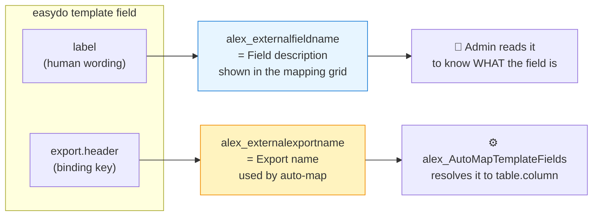

# Field Description vs. Export Name | תיאור שדה מול שם ייצוא

> Every template field synced from easydo is stored with **two distinct names** on
> `alex_templatefieldmapping`. They look similar but serve **opposite purposes** — one is
> for **humans**, the other is for **machines**. Confusing them is the single most common
> source of "why is this field blank / mismatched?" questions, so this document explains
> both the **business** and the **technical** meaning, in **English and Hebrew**.
>
> כל שדה תבנית שמסתנכרן מ‑easydo נשמר עם **שני שמות נפרדים** על `alex_templatefieldmapping`.
> הם נראים דומים אך משרתים **מטרות הפוכות** — אחד מיועד ל**בני אדם**, השני ל**מכונה**.
> בלבול ביניהם הוא הגורם הנפוץ ביותר לשאלות מסוג "למה השדה ריק / לא תואם?", ולכן מסמך זה
> מסביר את המשמעות ה**עסקית** וה**טכנית** של שניהם, ב**אנגלית ובעברית**.

---

## 1. The two columns at a glance | שתי העמודות במבט מהיר

| Column (schema)             | Display name         | Source in easydo    | Audience | Example                         |
| --------------------------- | -------------------- | ------------------- | -------- | ------------------------------- |
| `alex_externalfieldname`    | **Field description**| field `label`       | Human    | `First Name`, `שם מלא עובד`      |
| `alex_externalexportname`   | **Export name**      | field `export.header`| Machine  | `contact.firstname`             |

---

## 2. Field description (`alex_externalfieldname`) | תיאור שדה

### English — business meaning

The **field description** answers the question **"what is this field, in plain language?"**
It is the wording an easydo template author typed next to the placeholder — for example
`First Name`, `Employee full name`, `Monthly rent`, `Signature`. It carries **no binding
information**; it exists purely so a Dynamics administrator can **recognise** the field
when mapping it to a Dynamics column in the mapping grid (the Template Field Mapping PCF).

### English — technical meaning

- Populated by the **template sync flow** from the easydo field object's **`label`**
  property, with a safe fallback chain: `coalesce(label, export.header, name)` — so if a
  template author left the label empty, the admin still sees *something* meaningful rather
  than a blank row.
- Historically this held easydo's `placeholderLabel`, which turned out to be a **generic
  field-type name** (e.g. "Text field", "Date") rather than a real description. It was
  switched to `label`, the human‑authored wording, which is far more useful.
- It is **display‑only**: nothing in the send pipeline, the prefill resolver, or the
  auto‑mapper reads this column to make decisions. Changing it never changes behaviour.

### עברית — משמעות עסקית

**תיאור השדה** עונה על השאלה **"מה השדה הזה, בשפה פשוטה?"**. זהו הניסוח שכותב תבנית ה‑easydo
הקליד ליד ה‑placeholder — למשל `שם פרטי`, `שם מלא עובד`, `עלות לחודש`, `חתימה`. הוא **אינו
נושא מידע קישור** כלל; הוא קיים אך ורק כדי שמנהל ה‑Dynamics **יזהה** את השדה בזמן שהוא ממפה
אותו לעמודה ב‑Dynamics בטבלת המיפוי (פקד ה‑PCF של מיפוי שדות התבנית).

### עברית — משמעות טכנית

- מתמלא על ידי **זרימת סנכרון התבניות** מתוך המאפיין **`label`** של אובייקט השדה ב‑easydo,
  עם שרשרת גיבוי בטוחה: `coalesce(label, export.header, name)` — כך שאם כותב התבנית השאיר את
  ה‑label ריק, המנהל עדיין רואה משהו בעל משמעות ולא שורה ריקה.
- בעבר עמודה זו החזיקה את `placeholderLabel` של easydo, שהתברר כ**שם‑סוג שדה גנרי** (למשל
  "שדה טקסט", "תאריך") ולא תיאור אמיתי. היא הוחלפה ל‑`label`, הניסוח שנכתב על ידי אדם, שהוא
  שימושי בהרבה.
- העמודה היא **לתצוגה בלבד**: שום רכיב בצינור השליחה, ב‑resolver של ה‑prefill או במיפוי
  האוטומטי אינו קורא אותה לצורך החלטה. שינוי שלה לעולם אינו משנה התנהגות.

---

## 3. Export name (`alex_externalexportname`) | שם ייצוא

### English — business meaning

The **export name** answers the question **"where does this field's value come from in
Dynamics?"** It is the **stable binding key** easydo assigns to the field. Unlike the
description, it must **not** be edited casually — it is the contract that lets the system
fill the field automatically. If the description is *what the field is called*, the export
name is *the address the data lives at*.

### English — technical meaning

- Populated by the template sync from the easydo field's **`export.header`** property and
  stored as an opaque, stable key. It survives template renames (the label can change; the
  export header stays), which is why it — not the description — is used for automation.
- **Binding‑key grammar** (Dynamics logical names, table‑prefixed):

  | Pattern                                   | Meaning                          |
  | ----------------------------------------- | -------------------------------- |
  | `contact.firstname`                       | direct column on the table       |
  | `incident.new_productid.name`             | single‑target lookup **hop**     |
  | `incident.customerid.contact.fullname`    | polymorphic hop (explicit target)|

- Consumed by the **`alex_AutoMapTemplateFields`** Custom API to resolve each field to a
  concrete `table.column` (and lookup hop), populating `alex_dynamicstable`,
  `alex_dynamicsfield` and `alex_lookupfield`. Those resolved columns are what the prefill
  resolver and the send wizard actually read at send time.
- Because it is machine‑facing, an **empty or malformed** export name is what causes a
  field to stay blank at send time — the description being present does **not** help.

### עברית — משמעות עסקית

**שם הייצוא** עונה על השאלה **"מהיכן מגיע הערך של השדה ב‑Dynamics?"**. זהו **מפתח הקישור
היציב** ש‑easydo מקצה לשדה. בניגוד לתיאור, אין לערוך אותו כלאחר יד — זהו החוזה שמאפשר למערכת
למלא את השדה אוטומטית. אם התיאור הוא *איך קוראים לשדה*, שם הייצוא הוא *הכתובת שבה יושבים
הנתונים*.

### עברית — משמעות טכנית

- מתמלא על ידי סנכרון התבניות מתוך המאפיין **`export.header`** של השדה ב‑easydo ונשמר כמפתח
  אטום ויציב. הוא שורד שינויי שם של תבנית (ה‑label יכול להשתנות; ה‑export header נשאר), ולכן
  הוא — ולא התיאור — משמש לאוטומציה.
- **דקדוק מפתח הקישור** (שמות לוגיים ב‑Dynamics, עם קידומת טבלה):

  | תבנית                                     | משמעות                              |
  | ----------------------------------------- | ----------------------------------- |
  | `contact.firstname`                       | עמודה ישירה על הטבלה                 |
  | `incident.new_productid.name`             | **קפיצת** lookup ליעד יחיד           |
  | `incident.customerid.contact.fullname`    | קפיצה פולימורפית (יעד מפורש)         |

- נצרך על ידי ה‑Custom API **`alex_AutoMapTemplateFields`** כדי לפתור כל שדה ל‑`table.column`
  קונקרטי (וקפיצת lookup), וממלא את `alex_dynamicstable`, `alex_dynamicsfield` ו‑
  `alex_lookupfield`. אותן עמודות פתורות הן מה שה‑resolver של ה‑prefill ואשף השליחה קוראים
  בפועל בזמן השליחה.
- מכיוון שהוא פונה למכונה, שם ייצוא **ריק או פגום** הוא מה שגורם לשדה להישאר ריק בזמן שליחה —
  נוכחות התיאור **אינה** עוזרת.

---

## 4. Why keep both | למה לשמור את שניהם

| Concern                     | Field description        | Export name                     |
| --------------------------- | ------------------------ | ------------------------------- |
| Read by a human?            | ✅ yes                    | ⚙️ rarely                       |
| Drives automation?          | ❌ no                     | ✅ yes                          |
| Safe to edit?               | ✅ cosmetic only          | ⚠️ no — breaks binding          |
| Stable across renames?      | ❌ can change             | ✅ stays put                    |
| Empty ⇒ symptom             | ugly/blank grid label    | field stays **empty at send**   |

**Rule of thumb — כלל אצבע:** if a field shows the *wrong label*, look at the **description**
(`alex_externalfieldname`). If a field is *empty when sent*, look at the **export name**
(`alex_externalexportname`) and the resolved `table` / `column` / `lookup` it produced.

> אם שדה מציג *תווית שגויה* — בדוק את **תיאור השדה**. אם שדה *ריק בשליחה* — בדוק את **שם
> הייצוא** ואת ה‑`table` / `column` / `lookup` שהוא הפיק.

---

## 5. Related | קשור

- Data model: [data-model.md](data-model.md)
- Technical architecture: [technical-architecture.md](technical-architecture.md)
- Sync flow schema: [flow-schemas.md](flow-schemas.md)
- Column definition script: [../src/scripts/37-add-exportname-column.ps1](../src/scripts/37-add-exportname-column.ps1)
