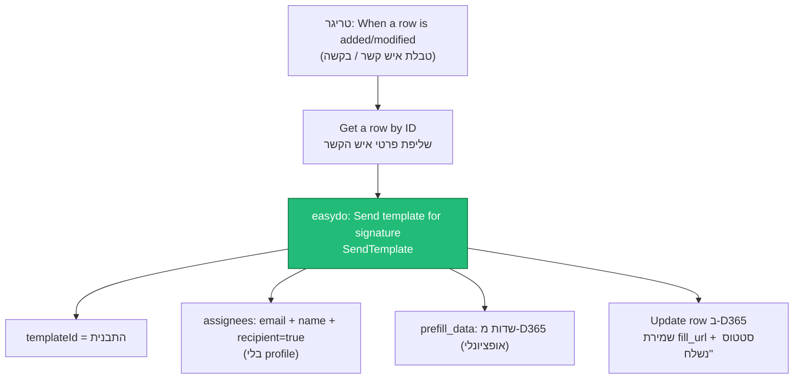
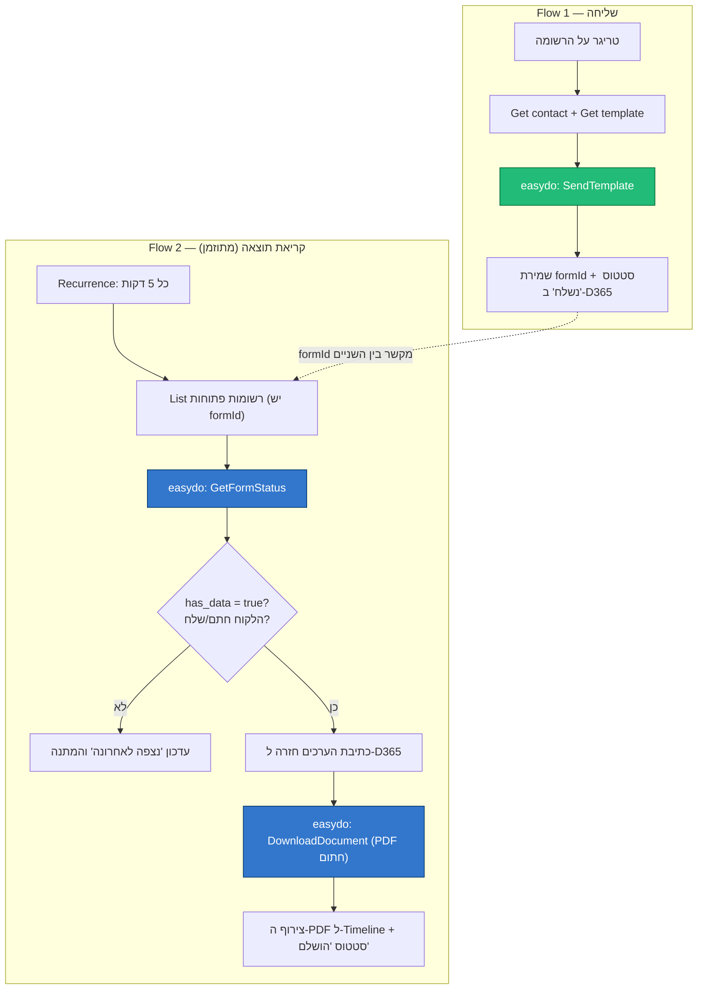
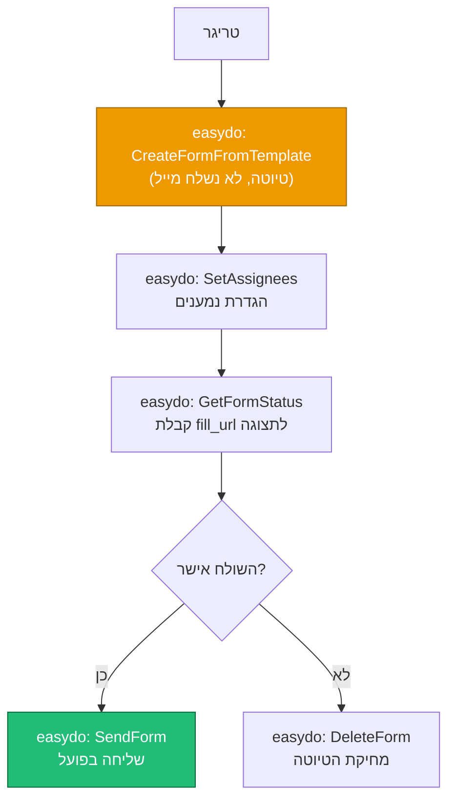
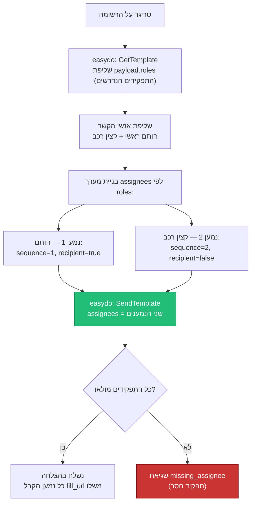

# סכימות Flow למיישם — D365 ↔ easydo

תרשימי זרימה (Mermaid) למסלולים הנפוצים שמיישם בונה ב‑Power Automate מול הקונקטור של easydo.
התרשימים הם **סכמטיים** — להמחשת הלוגיקה, לא ייצוא של Flow אמיתי.

הקונקטור עצמו: [src/custom-connector/apiDefinition.swagger.json](../src/custom-connector/apiDefinition.swagger.json)
דוגמאות Flow אמיתיות: [src/flows/](../src/flows/)

---

## סכימה א' — שליחה בסיסית (חד‑כיוונית)

המסלול הפשוט: טריגר ← שליפת איש קשר ← `SendTemplate`. **אין readback** — התוצאה נשארת ב‑easydo.

המיישם שולף את איש הקשר, שולח את התבנית עם מייל+שם כנמען זמני, ושומר ב‑D365 את קישור החתימה.
מספיק כשרק רוצים *לשלוח* — לא לקבל תוצאה בחזרה.

---

## סכימה ב' — שליחה + תגובה (readback מלא)

שני flows נפרדים: אחד שולח, ואחד מתוזמן שמושך את התוצאה כשהלקוח חתם.

ה‑formId שנשמר ב‑Flow 1 הוא החוליה המקשרת. Flow 2 רץ במחזוריות, בודק לכל בקשה פתוחה אם הלקוח כבר חתם
(`has_data`), וכשכן — מושך את הערכים וה‑PDF החתום בחזרה ל‑D365.
מימוש אמיתי: [src/flows/read-signature-results.flow.json](../src/flows/read-signature-results.flow.json).

---

## סכימה ג' — תצוגה מקדימה לפני שליחה

כשרוצים שהשולח יראה את המסמך הממולא לפני שהלקוח מקבל אותו.

במקום לשלוח מיד, יוצרים טיוטה (`CreateFormFromTemplate`), מציגים אותה (`GetFormStatus` ← `fill_url`),
ורק לאחר אישור שולחים (`SendForm`) — או מוחקים (`DeleteForm`).

---

## סכימה ד' — שליחה רב‑נמענים עם תפקידים (חותם + קצין רכב)

כשהתבנית דורשת כמה תפקידים (`roles`), צריך למפות **נמען לכל תפקיד** לפי סדר החתימה —
אחרת מתקבלת שגיאת `missing_assignee`.

קודם שולפים מהתבנית את רשימת התפקידים (`GetTemplate` ← `payload.roles`), אחר כך בונים `assignees`
שבו לכל תפקיד יש נמען עם ה‑`sequence` הנכון. **רק** הנמען הראשי הוא `recipient=true`; השאר `false`.
אם תפקיד נשאר בלי נמען — easydo מחזיר `missing_assignee`.

### האתגר בבניית ה‑action ב‑Flow

1. **מספר משתנה של נמענים** — לכל תבנית מספר תפקידים שונה, אבל ב‑Flow מגדירים מספר פריטי assignee
   קבוע בזמן עיצוב. כדי לתמוך בכל תבנית צריך לבנות את מערך ה‑assignees דינמית (Select/Loop על ה‑roles).
2. **אין binding לתפקיד** — מעצב ה‑Flow לא יכול לבחור איזה נמען שייך לאיזה role; הכול נשען על
   `sequence`, וזה שביר.
3. **הלוגיקה "איזה איש קשר = איזה תפקיד" חיה מחוץ ל‑easydo** — צריך למפות זאת ב‑D365 ולהבטיח התאמה
   לפי sequence בזמן ריצה.
