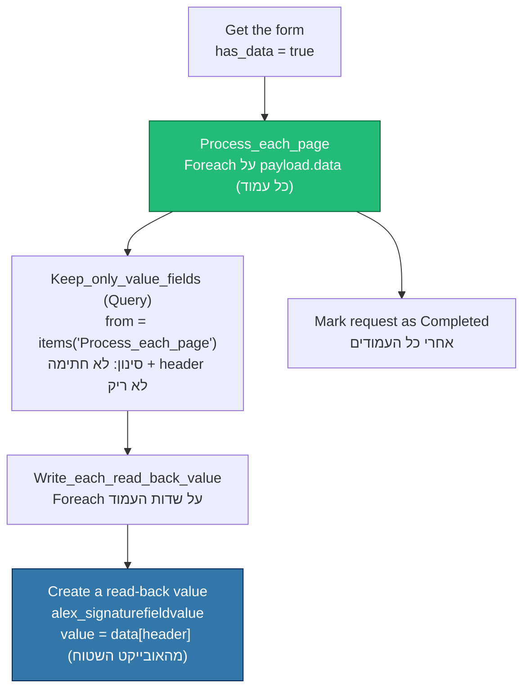

# קריאת תוצאות ממסמך רב‑עמודים — תיקון Read‑Back

מסמך למיישם: מה היה הבאג בקריאת הערכים החתומים בחזרה ל‑Dynamics, למה הוא קרה, ואיך התיקון עובד על **כמות עמודים ושדות בלתי‑מוגבלת**.

זרימה מושפעת: [src/flows/read-signature-results.flow.json](../src/flows/read-signature-results.flow.json)

---

## 1. רקע — איך easydo מחזירה את נתוני הטופס

הקריאה מתבצעת מול `GET /entity/me/forms/{id}`. בתשובה יש שני מקומות שבהם יושבים הנתונים:

| שדה בתשובה | מבנה | מה יש בו |
|---|---|---|
| `data` (top‑level) | **אובייקט שטוח**, ממופתח לפי `export.header` | כל הערכים שהלקוח מילא, מכל העמודים, בלי תלות בעמוד. לדוגמה `data["alex_os_payment_currency"] = "דולר"` |
| `payload.data` | **מערך של מערכים** — כל איבר = עמוד אחד ב‑PDF | המטא‑דאטה של השדות (name, label, type, export.header) מקובצת **לפי עמוד** |

> **עיקרון מפתח:** `payload.data[i]` מתאים ל‑`indexPage = i`. מסמך בן 26 עמודים ⇐ 26 איברים במערך. שדה שנמצא בעמוד 23 יופיע ב‑`payload.data[23]` בלבד — אבל הערך שלו תמיד קיים גם ב‑`data` השטוח.

---

## 2. הבאג — נקראה רק העמוד הראשון

הפעולה `Keep_only_value_fields` (מסוג Query) שאבה את רשימת השדות מ:

```
"from": "@first(body('Get_the_form')?['payload']?['data'])"
```

`first(...)` מחזיר את **האיבר הראשון בלבד** = עמוד 0. כל שדה שנמצא בעמוד 1 ואילך (כולל שדה המטבע בעמוד 23) פשוט לא נכנס ללולאה, ולכן **לא נוצרה עבורו רשומת `alex_signaturefieldvalue`**, וה‑WriteBackPlugin לא קיבל מה לכתוב חזרה.

### למה זה עבד עד עכשיו?
הזרימה נבנתה ונבדקה מול **תבניות בדיקה של עמוד אחד** (למשל `68729`, `68793`). שם כל השדות ישבו ב‑`payload.data[0]`, אז `first(...)` תפס את הכל. ההנחה הסמויה "עמוד ראשון = כל השדות" נשברה ברגע שהגיע חוזה אמיתי רב‑עמודים (`69985` — "חוזה הרשאה 2026", 26 עמודים).

זו **מגבלת תכנון**, לא תקלת נתונים — הנתונים תמיד היו קיימים ב‑easydo.

---

## 3. התיקון — מעבר על כל העמודים

עטפנו את הלוגיקה הקיימת בלולאה חיצונית `Process_each_page` שרצה על **כל** `payload.data` (כל העמודים), ובתוכה נשמרת אותה לוגיקת סינון + יצירה:



### מה השתנה בקוד
| לפני | אחרי |
|---|---|
| `from: @first(payload.data)` — עמוד 0 בלבד | `Process_each_page` Foreach על `@body('Get_the_form')?['payload']?['data']`, וה‑Query קורא `@items('Process_each_page')` — כל עמוד בתורו |
| `item()` בתוך לולאה בודדת | `items('Write_each_read_back_value')` (הפניה מפורשת, בטוחה בלולאה מקוננת) |
| `Mark_request_as_Completed` תלוי ב‑`Write_each_read_back_value` | תלוי ב‑`Process_each_page` (מסתיים רק אחרי כל העמודים) |

### למה זה בלתי‑מוגבל
* **כמות עמודים** — הלולאה `Process_each_page` רצה על כל איברי `payload.data`, בלי מספר קבוע.
* **כמות שדות** — הלולאה הפנימית `Write_each_read_back_value` רצה על כל השדות של אותו עמוד.
* **הערך עצמו** נשאב תמיד מהאובייקט השטוח `data[header]`, שכבר מכיל את כל העמודים.
* שדות חתימה (`input-signature`) ושדות בלי `export.header` מסוננים החוצה כמו קודם.

---

## 4. מגבלות מעשיות של Power Automate (חשוב לדעת)

התיקון אגנוסטי למספר העמודים ברמת הלוגיקה, אבל ב‑Power Automate יש תקרות מעשיות שכדאי להכיר עבור מסמכים חריגים בגודלם:

| נושא | תקרת ברירת מחדל | מה לעשות אם חורגים |
|---|---|---|
| Pagination בפעולות list/loop | ~5,000 פריטים | להפעיל pagination ידני בפעולה |
| Throttling ב‑Dataverse ביצירת רשומות | תלוי סביבה | `concurrency.repetitions = 1` (כבר מוגדר) שומר על ריצה סדרתית ומונע חניקה |
| זמן ריצה של הזרימה | תלוי מנוי | לפצל לאצווה (batch) בתרחיש קיצוני |

עבור חוזה סטנדרטי (עשרות עמודים, עשרות שדות) — התיקון מספיק לחלוטין ולא נדרש כוונון נוסף.

---

## 5. המרת ערך אופציה (Optionset) בכתיבה חזרה

שדה כמו מטבע נשמר ב‑easydo כטקסט (`"דולר"`), אבל בעמודת ה‑Optionset ב‑Dynamics צריך ערך מספרי. ה‑`ValueConverter` בתוך ה‑WriteBackPlugin ממיר לפי **label** או לפי **value**.

> ⚠️ ודא שה‑Global Choice של עמודת היעד (למשל `alex_payment_currency`) מכיל אופציה עם **label זהה** לטקסט שחוזר מ‑easydo (`"דולר"`). אם ה‑label לא תואם — הכתיבה תיכשל בהמרה למרות שהרשומה `alex_signaturefieldvalue` נוצרה.

---

## 6. בדיקת שפיות אחרי פריסה

1. שלח בקשה מתבנית רב‑עמודים והשלם חתימה.
2. המתן להרצת `read-signature-results` (כל 5 דקות) או הרץ ידנית.
3. ודא שנוצרו רשומות `alex_signaturefieldvalue` (direction = ReadBack) **גם לשדות מעמודים מאוחרים** — לא רק מעמוד 0.
4. ודא שה‑WriteBackPlugin כתב את הערכים לעמודות היעד ברשומה הראשית.
