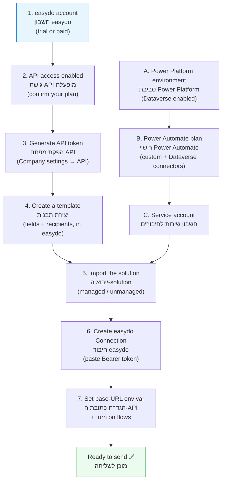

# Prerequisites | דרישות מקדימות

> What you need **before** installing the D365 ↔ easydo integration — with an emphasis
> on the **easydo side** (account, API access, where the API key comes from, trial and
> contact details).
>
> מה צריך **לפני** התקנת האינטגרציה D365 ↔ easydo — עם דגש על **צד easydo** (חשבון,
> גישת API, מהיכן משיגים את מפתח ה‑API, חשבון ניסיון ופרטי קשר).

---

## 1. At a glance | במבט מהיר

---

## 2. easydo side | בצד easydo

### 2.1 Account | חשבון

You need an **active easydo account** for your company (the "entity"). easydo offers a
**free trial** — you can open one immediately and upgrade later.

נדרש **חשבון easydo פעיל** עבור החברה שלך ("entity"). ל‑easydo יש **חשבון ניסיון חינם**
— אפשר לפתוח אותו מיד ולשדרג בהמשך.

| | Link |
| --- | --- |
| Free trial / sign‑up · ניסיון חינם / הרשמה | https://app.easydo.co.il/signup |
| Log in · התחברות | https://app.easydo.co.il/login |
| Product site · אתר המוצר | https://easydo.co.il |

### 2.2 API access | גישת API

The integration talks to the **easydo REST API**. API access can depend on your
**plan/tier**, so confirm with easydo that API access is enabled for your company
entity **before** you start.

האינטגרציה עובדת מול **ה‑REST API של easydo**. גישת ה‑API עשויה להיות תלוית **חבילה**,
לכן ודא מול easydo שגישת ה‑API מופעלת לחברה שלך **לפני** שמתחילים.

- **API documentation** ("Getting Started – Company") · **תיעוד ה‑API**:
  https://easydoc.stoplight.io/docs/easydoc/hq8mzxlcclv2i-getting-started-company

### 2.3 Where the API key comes from | מהיכן משיגים את מפתח ה‑API

The connection authenticates with a **Bearer token** generated inside the easydo
portal: **Company settings → API**. The same token is later pasted into the Power
Platform **Connection** (never into code or source control).

החיבור מזדהה באמצעות **טוקן Bearer** שמופק בתוך פורטל easydo: **הגדרות חברה → API**.
אותו טוקן מודבק בהמשך ל‑**Connection** ב‑Power Platform (לעולם לא בקוד או ב‑Git).

> The token is a **secret**. Rotate it if it was ever shared, and store it only in the
> secure Connection. See [security-model.md](security-model.md).
>
> הטוקן הוא **סוד**. החלף אותו אם נחשף אי‑פעם, ושמור אותו רק ב‑Connection המאובטח.

### 2.4 A template | תבנית

Templates are **built in easydo** (not in Dynamics) — including their fields and
default recipients. At least **one template** must exist before you send.

התבניות **נבנות ב‑easydo** (לא ב‑Dynamics) — כולל השדות והנמענים. נדרשת לפחות **תבנית
אחת** לפני שליחה.

### 2.5 easydo contact | פרטי קשר easydo

| | Details · פרטים |
| --- | --- |
| Phone · טלפון | **072‑222‑1600** ([tel](tel:0722221600)) |
| Contact / book a demo · צור קשר / תיאום דמו | https://easydo.co.il/%d7%a6%d7%95%d7%a8-%d7%a7%d7%a9%d7%a8/ |
| Help center · מרכז עזרה | https://support.easydoc.co.il/ |
| Integrations · אינטגרציות | https://easydo.co.il/%d7%90%d7%99%d7%a0%d7%98%d7%92%d7%a8%d7%a6%d7%99%d7%95%d7%aa/ |

> For **API‑specific** questions (token, plan, endpoints), ask easydo support or your
> account manager to confirm API access and point you to the current API docs.
>
> לשאלות **ספציפיות ל‑API** (טוקן, חבילה, נקודות קצה) — פנה לתמיכת easydo או למנהל
> הלקוח שלך לאישור גישת ה‑API ולהפניה לתיעוד העדכני.

---

## 3. Microsoft / Power Platform side | בצד Microsoft / Power Platform

### Accounts & licensing | חשבונות ורישוי
- A **Power Platform environment** with **Dataverse** enabled (Dev, and later Test/Prod).
- A **Power Automate** plan that allows **custom connectors** and the **Dataverse** connector.
- A **dedicated service account** to own the connections (recommended for Test/Prod).

### Tooling | כלים
- **Power Platform CLI (`pac`)** — see [../deployment/pac-cli.md](../deployment/pac-cli.md).
- **PowerShell 7+** to run the helper scripts in [../src/scripts/](../src/scripts/).
- **Azure CLI (`az`)** for obtaining a Dataverse Web API token during setup.
- **Git** for source control.

### Configuration values | ערכי תצורה
- The **easydo API base URL** (`https://api.easydo.co.il/api`) and **token**, supplied
  as an Environment Variable + a secure Connection — never committed.
- The target **Dataverse environment URL**, kept outside the repo (e.g. local `.env.ps1`).

> Full install steps are in [deployment-guide.md](deployment-guide.md); the solution
> ships as **managed** (Test/Prod/customer) and **unmanaged** (Dev) on the
> [Releases](https://github.com/alexander-you/D365-easydo/releases) page.

---

## 4. Get help / report a problem | קבלת עזרה / דיווח על תקלה

| Topic · נושא | Where · היכן |
| --- | --- |
| **Bug** in this integration · **באג** באינטגרציה | [Open an issue](https://github.com/alexander-you/D365-easydo/issues/new/choose) · פתיחת issue |
| **Question / idea / discussion** · **שאלה / רעיון / דיון** | [Discussions](https://github.com/alexander-you/D365-easydo/discussions) |
| **easydo** account / API / signing service · חשבון / API / שירות החתימות | easydo support (§2.5) |

> Use **GitHub Issues** for problems with *this integration* (the connector, flows,
> data model). Use **easydo support** for anything about the easydo product itself
> (account, API access, templates, signatures).
>
> השתמש ב‑**GitHub Issues** לתקלות ב*אינטגרציה עצמה* (הקונקטור, הזרימות, מודל הנתונים).
> פנה ל‑**תמיכת easydo** לכל דבר במוצר easydo עצמו (חשבון, גישת API, תבניות, חתימות).
