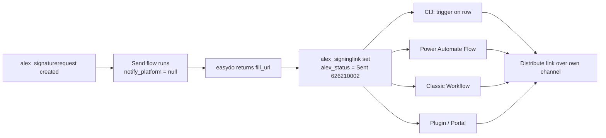

# Self‑Distribution Contract — `alex_signaturerequest`

> **עברית למטה** · English first, Hebrew below.
> Status: design contract · Env: demo-contact-center-en.crm4.dynamics.com · Solution: `alex_d365_easydo`

---

## English

### 1. What this document defines

There are two ways a signing link reaches a recipient in this integration:

1. **easydo native send** — easydo notifies the recipient itself over the **primary
   channel** (`email` / `sms` / `whatsapp`). This is the default path.
2. **Self‑distribution** — the customer distributes the signing link over **their own
   channel** (Customer Insights – Journeys, a Power Automate Flow, a classic
   Workflow, a plugin, a portal, etc.). easydo only **generates** the link and does
   **not** notify.

This document defines the **integration contract** for case (2): the single,
mechanism‑independent way any customer process can pick up a signing request and
distribute it. The rule is:

> **The trigger is always the creation / update of an `alex_signaturerequest` row
> reaching a state where the signing link is ready. No matter the mechanism (CIJ,
> Flow, Workflow, plugin), the contract is the same: subscribe to the row, read the
> link, distribute it.**

### 2. Why easydo can return "just a link"

When the send step (`PUT /entity/me/forms/{id}/send`) runs, easydo always returns a
per‑assignee **`fill_url`**. The `notify_platform` field on each assignee controls
notification only:

| `notify_platform` | easydo behaviour |
| --- | --- |
| `email` / `sms` / `whatsapp` | easydo sends its native notification on that channel. |
| `null` | easydo generates the `fill_url` **without notifying** — pure link‑only. |

The Send flow already stores the returned link on the request. **For
self‑distribution the only change is `notify_platform = null`** so easydo stays
silent and the customer's channel is the sole distributor (no double‑send).

### 3. The contract — fields on `alex_signaturerequest`

| Field | Type | Role in the contract |
| --- | --- | --- |
| `alex_signaturerequestid` | Unique id | The row a consumer subscribes to. |
| `alex_status` | Choice `alex_signaturestatus` | Lifecycle gate (see §4). |
| `alex_signinglink` | URL | **The signing link to distribute** (easydo `fill_url`). |
| `alex_easydochannel` | Choice `alex_easydochannel` | Primary channel snapshot (Email 626210000 / SMS 626210001 / WhatsApp 626210002). |
| `alex_externalformid` | Text | easydo form id (correlation / support). |
| `alex_senton` | DateTime | When the link was generated. |
| `alex_primaryrecordid` + `alex_primarytable` | Text | Originating record (who to send to). |
| Related `alex_signaturerecipient` rows | — | `alex_name`, `alex_email`, `alex_phone`, `alex_signingorder` — the actual recipient(s). |

### 4. Status lifecycle (`alex_status` / `alex_signaturestatus`)

| Value | Label (He) | Meaning | Link ready? |
| --- | --- | --- | --- |
| 626210000 | טיוטה | Draft | No |
| 626210001 | מוכן למשלוח | Ready to Send (triggers the Send flow) | No |
| **626210002** | **נשלח** | **Sent — `alex_signinglink` populated** | **Yes** |
| 626210003 | נמסר | Delivered | Yes |
| 626210004 | נצפה | Viewed | Yes |
| 626210005 | בתהליך | In Progress | Yes |
| 626210006 | הושלם | Completed | — |
| 626210007 | נדחה | Declined | — |
| 626210008 | נכשל | Failed | — |
| 626210009 | בוטל | Cancelled | — |
| 626210010 | פג תוקף | Expired | — |
| 626210011 | ממתין לניסיון חוזר | Waiting for retry | — |

**Consumer trigger condition:** the row reaches **`alex_status = 626210002` (Sent)**
*and* `alex_signinglink` is non‑empty. Equivalent and more robust: trigger on
**`alex_signinglink` changing from empty to non‑empty** (filtering attribute
`alex_signinglink`).

### 5. How each mechanism subscribes (all equivalent)



- **Customer Insights – Journeys (CIJ):** a journey triggered by the Dataverse
  trigger on `alex_signaturerequest` (segment / trigger on `alex_signinglink ne
  null`). Reads the link + recipient and sends via its own email/SMS/WhatsApp.
- **Power Automate Flow:** "When a row is added or modified" on
  `alex_signaturerequests`, filtering attribute `alex_signinglink` (or trigger
  condition on `alex_status`). Reads the link and posts to any connector.
- **Classic Workflow:** scoped on update of `alex_signaturerequest` with a condition
  `alex_signinglink contains data`. Suitable for synchronous, no‑code routing.
- **Plugin:** registered on Update of `alex_signaturerequest`, filtering attribute
  `alex_signinglink`. For fully custom server‑side distribution.

**Contract invariant:** none of these read easydo directly. They only read
`alex_signaturerequest` (+ its `alex_signaturerecipient` children). easydo stays
behind the Send flow.

### 6. Recommended trigger condition (Flow example)

Trigger: *When a row is added, modified or deleted* → `alex_signaturerequests`,
Scope = Organization, **Select columns** `alex_signinglink,alex_status`,
**Filter rows** `alex_signinglink ne null`, **Trigger condition**:

```
@not(equals(coalesce(triggerOutputs()?['body/alex_signinglink'], ''), ''))
```

This fires exactly once, when the link first appears, regardless of later status
changes.

---

## עברית

### 1. מה המסמך הזה מגדיר

יש שתי דרכים שבהן קישור חתימה מגיע לנמען באינטגרציה הזו:

1. **שליחה נייטיב של easydo** — easydo עצמה מודיעה לנמען דרך **הערוץ הראשי**
   (`email` / `sms` / `whatsapp`). זו ברירת המחדל.
2. **הפצה עצמית** — הלקוח מפיץ את קישור החתימה דרך **ערוץ משלו** (מסעות לקוח /
   Power Automate Flow / Workflow קלאסי / Plugin / פורטל וכו'). easydo רק **מייצרת**
   את הקישור ו**לא** מודיעה.

המסמך מגדיר את **חוזה האינטגרציה** למקרה (2): הדרך האחת, הבלתי‑תלויה‑במנגנון, שבה כל
תהליך של הלקוח יכול לתפוס בקשת חתימה ולהפיץ אותה. הכלל:

> **הטריגר הוא תמיד יצירה / עדכון של רשומת `alex_signaturerequest` שמגיעה למצב שבו
> קישור החתימה מוכן. לא משנה המנגנון (CIJ, Flow, Workflow, Plugin) — החוזה זהה:
> להאזין לרשומה, לקרוא את הקישור, להפיץ אותו.**

### 2. למה easydo יכולה להחזיר "רק קישור"

כשצעד השליחה (`PUT /entity/me/forms/{id}/send`) רץ, easydo תמיד מחזירה `fill_url`
לכל נמען. השדה `notify_platform` של כל נמען שולט **רק על ההודעה**:

| `notify_platform` | התנהגות easydo |
| --- | --- |
| `email` / `sms` / `whatsapp` | easydo שולחת הודעה נייטיב בערוץ הזה. |
| `null` | easydo מייצרת את ה‑`fill_url` **בלי להודיע** — קישור בלבד. |

ה‑Send flow כבר שומר את הקישור על הבקשה. **להפצה עצמית, השינוי היחיד הוא
`notify_platform = null`** כדי ש‑easydo תשתוק והערוץ של הלקוח יהיה המפיץ היחיד (בלי
שליחה כפולה).

### 3. החוזה — שדות על `alex_signaturerequest`

| שדה | סוג | תפקיד בחוזה |
| --- | --- | --- |
| `alex_signaturerequestid` | מזהה ייחודי | הרשומה שאליה הצרכן מאזין. |
| `alex_status` | Choice `alex_signaturestatus` | שער מחזור החיים (ר' §4). |
| `alex_signinglink` | URL | **קישור החתימה להפצה** (ה‑`fill_url` של easydo). |
| `alex_easydochannel` | Choice `alex_easydochannel` | תצלום הערוץ הראשי (Email 626210000 / SMS 626210001 / WhatsApp 626210002). |
| `alex_externalformid` | טקסט | מזהה הטופס ב‑easydo (קישור / תמיכה). |
| `alex_senton` | תאריך/שעה | מתי הקישור נוצר. |
| `alex_primaryrecordid` + `alex_primarytable` | טקסט | הרשומה שממנה יצא (למי לשלוח). |
| רשומות `alex_signaturerecipient` קשורות | — | `alex_name`, `alex_email`, `alex_phone`, `alex_signingorder` — הנמען(ים) בפועל. |

### 4. מחזור החיים של הסטטוס (`alex_status`)

| ערך | תווית | משמעות | קישור מוכן? |
| --- | --- | --- | --- |
| 626210000 | טיוטה | Draft | לא |
| 626210001 | מוכן למשלוח | מפעיל את ה‑Send flow | לא |
| **626210002** | **נשלח** | **`alex_signinglink` מתמלא** | **כן** |
| 626210003 | נמסר | Delivered | כן |
| 626210004 | נצפה | Viewed | כן |
| 626210005 | בתהליך | In Progress | כן |
| 626210006 | הושלם | Completed | — |
| 626210007 | נדחה | Declined | — |
| 626210008 | נכשל | Failed | — |
| 626210009 | בוטל | Cancelled | — |
| 626210010 | פג תוקף | Expired | — |
| 626210011 | ממתין לניסיון חוזר | Waiting retry | — |

**תנאי הטריגר לצרכן:** הרשומה מגיעה ל‑**`alex_status = 626210002` (נשלח)** *וגם*
`alex_signinglink` לא ריק. שקול ועמיד יותר: טריגר על **`alex_signinglink` שמשתנה
מריק ללא‑ריק** (filtering attribute `alex_signinglink`).

### 5. איך כל מנגנון מאזין (כולם שקולים)

- **מסעות לקוח (CIJ):** מסע שמותנע בטריגר Dataverse על `alex_signaturerequest`
  (סגמנט / טריגר על `alex_signinglink ne null`). קורא את הקישור + הנמען ושולח דרך
  ערוץ ה‑email/SMS/WhatsApp שלו.
- **Power Automate Flow:** "כאשר שורה נוספת או משתנה" על `alex_signaturerequests`,
  filtering attribute `alex_signinglink` (או trigger condition על `alex_status`).
  קורא את הקישור ושולח לכל connector.
- **Workflow קלאסי:** scope על עדכון `alex_signaturerequest` עם תנאי
  `alex_signinglink contains data`. מתאים לניתוב סינכרוני ללא קוד.
- **Plugin:** רשום על Update של `alex_signaturerequest`, filtering attribute
  `alex_signinglink`. להפצה צד‑שרת מותאמת לחלוטין.

**אינווריאנט החוזה:** אף אחד מהם לא קורא ל‑easydo ישירות. כולם קוראים רק את
`alex_signaturerequest` (+ ילדי `alex_signaturerecipient`). easydo נשארת מאחורי
ה‑Send flow.

### 6. תנאי טריגר מומלץ (דוגמת Flow)

טריגר: *כאשר שורה נוספת, משתנה או נמחקת* → `alex_signaturerequests`,
Scope = Organization, **עמודות** `alex_signinglink,alex_status`,
**סינון שורות** `alex_signinglink ne null`, **תנאי טריגר**:

```
@not(equals(coalesce(triggerOutputs()?['body/alex_signinglink'], ''), ''))
```

זה נורה בדיוק פעם אחת, כשהקישור מופיע לראשונה, ללא תלות בשינויי סטטוס מאוחרים.
